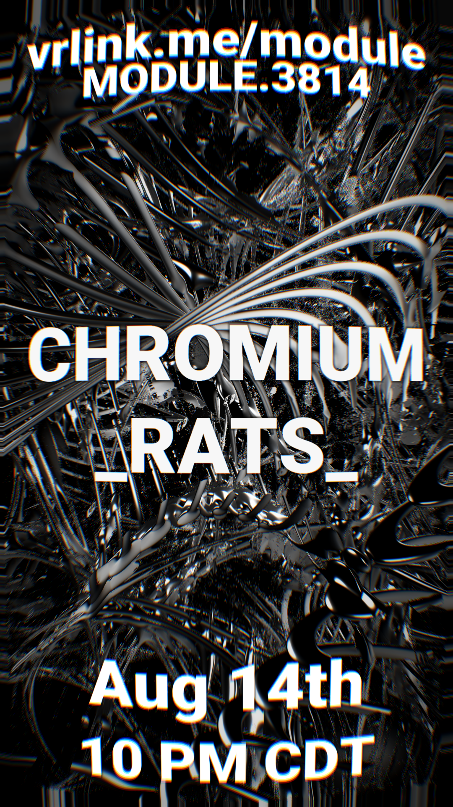

# Module Events

[Module](index.md) runs monthly events, listed here is all the events that have run along with their posters.

---

## Access #2

Date & Time: `2025-10-25 9:45PM CT`

DJs:
<!---->
1. luce
2. VRMasked
3. Chromium
<!---->
VJ
<!---->
- Nighthawk
<!---->

vrc.tl: [Event on VRCTL](https://vrc.tl/event/17648){:target="_blank"}

VOD: [View on VRCDN](https://vrcdn.video/static/nighthawkvrc_ModuleAccess2){:target="_blank"}

Poster by [hudsun](https://x.com/hudsun_){:target="_blank"}

{ width="400" loading=lazy }

---

## Access #1

Date & Time: `2025-09-18 9:45PM CT`

DJs:
<!---->
1. \_rats\_
2. Schwank
3. Chromium
<!---->
VJ:
<!---->
- Nighthawk
<!---->

vrc.tl: [Event on VRCTL](https://vrc.tl/event/16608){:target="_blank"}

VOD: [View on VRCDN](https://vrcdn.video/static/nighthawkvrc_ModuleAccess1){:target="_blank"}

Poster by [hudsun](https://x.com/hudsun_){:target="_blank"} and Nighthawk

{ width="400" loading=lazy }

---

## Access #0

Date & Time: `2025-08-14 9:45PM CT`

DJs:
<!---->
1. \_rats\_
2. Chromium
<!---->
VJ:
<!---->
- Nighthawk
<!---->

vrc.tl: [Event on VRCTL](https://vrc.tl/event/15214){:target="_blank"}

VOD: [View on VRCDN](https://vrcdn.video/static/nighthawkvrc_ModuleAccess0){:target="_blank"}

Poster by Nighthawk

{ width="400" loading=lazy }
