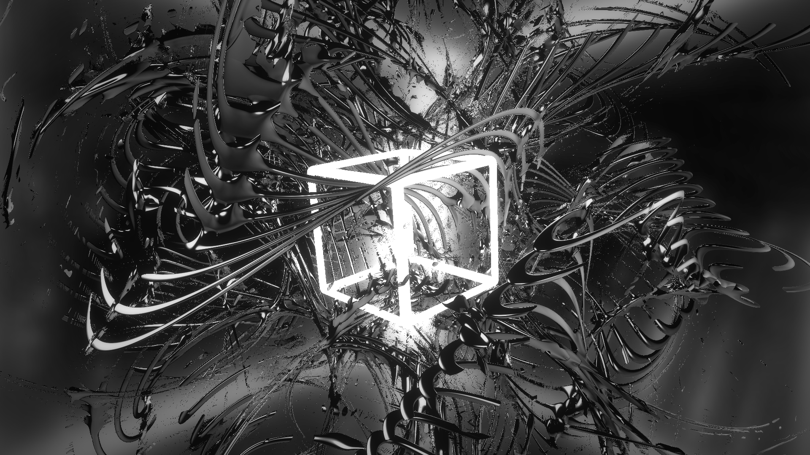
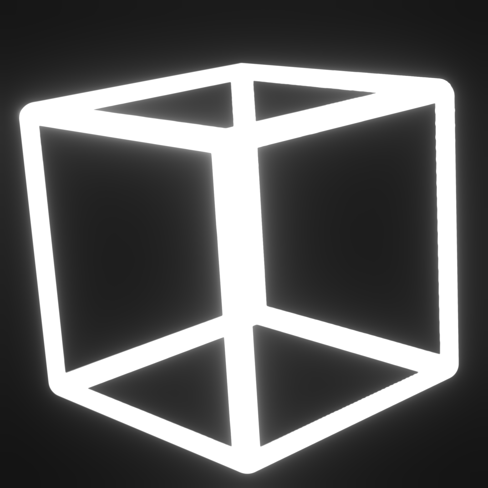
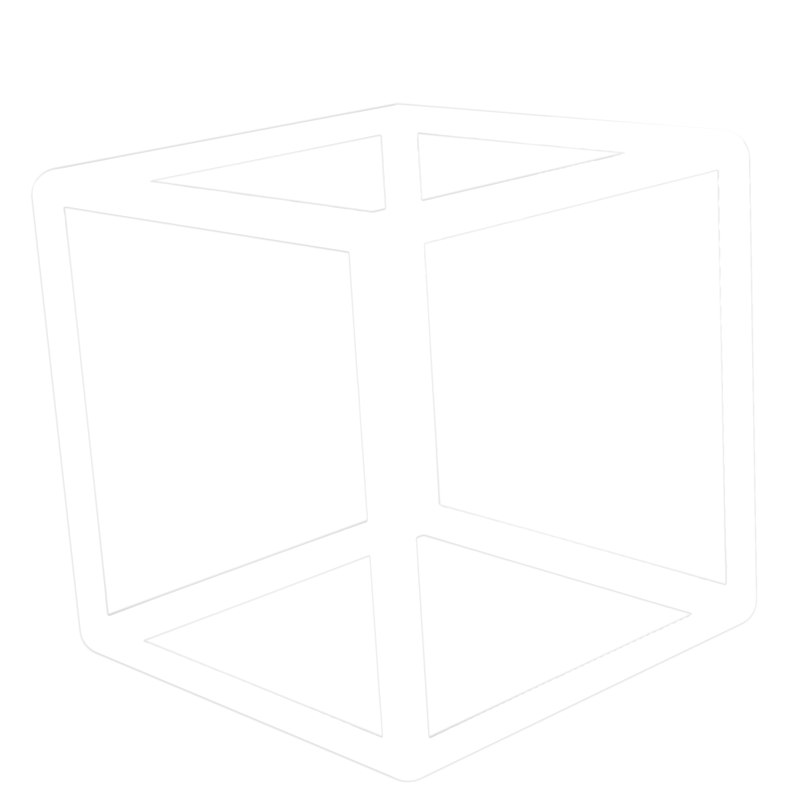

# Module Material

Listed here are images and other material used in and for [Module](index.md).
If you need any variations that aren't here, you can find a list of contacts/socials at [gravinium.org](https://gravinium.org){:target="_blank"}.

---

## Module Banner

- Dimensions: `1920x1080`

{ width="500" loading=lazy }

---

## Module Logo

- Dimensions: `2048x2048`

{ width="500" loading=lazy }

---

## Module Cube

- Dimensions: `2048x2048`

{ width="500" loading=lazy }

---

## Module Cube Transparent

- Dimensions: `2048x2048`

{ width="500" loading=lazy }
